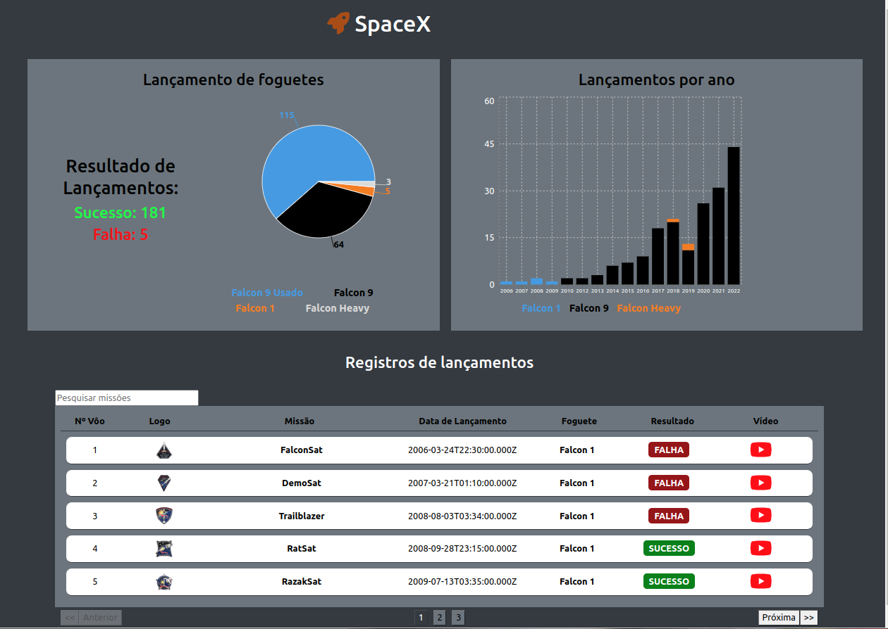
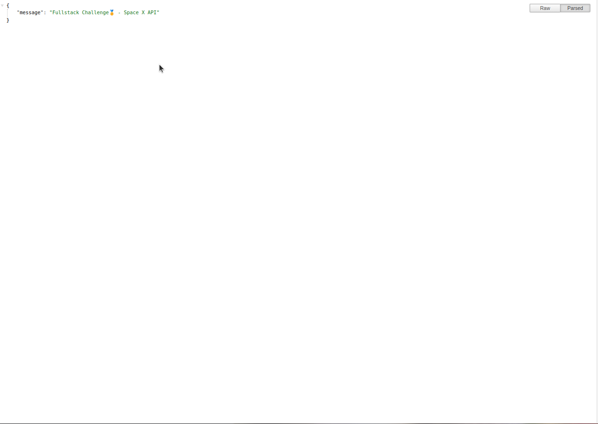
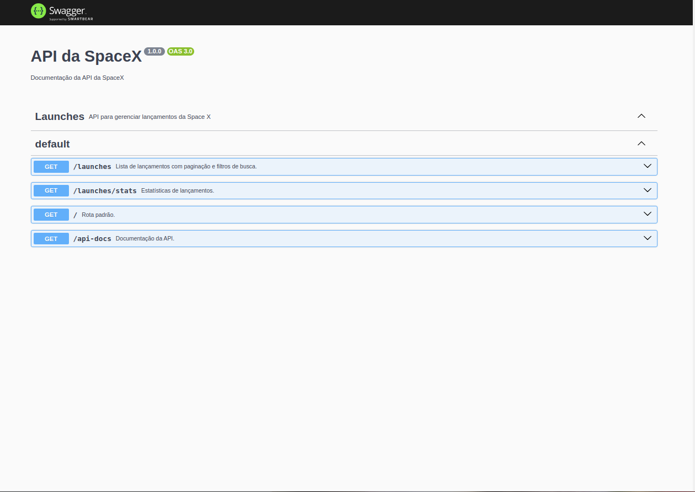
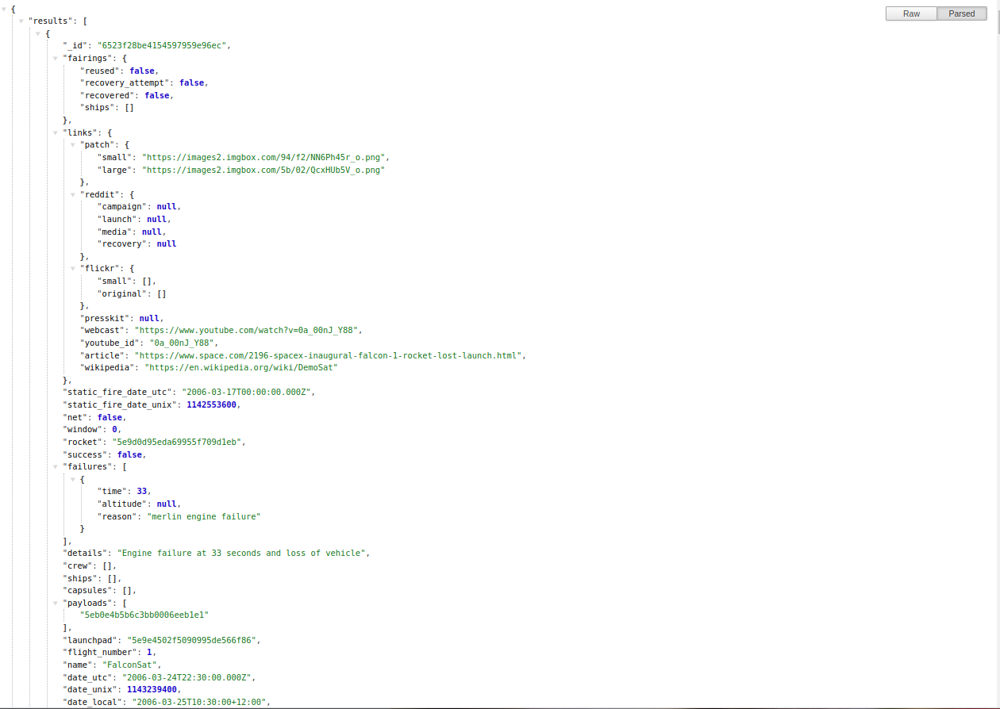
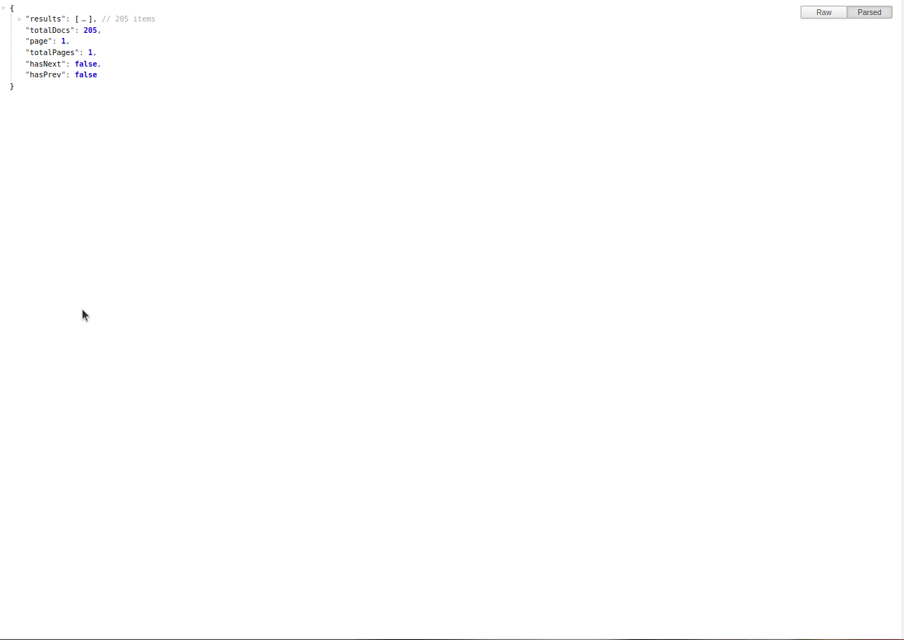
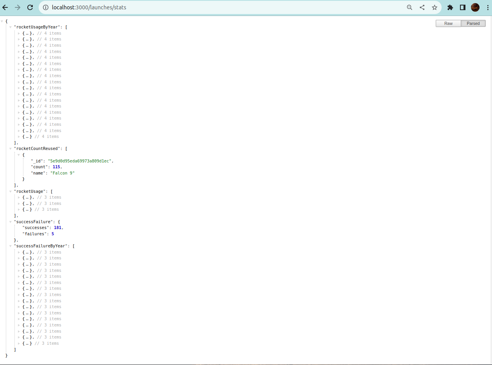
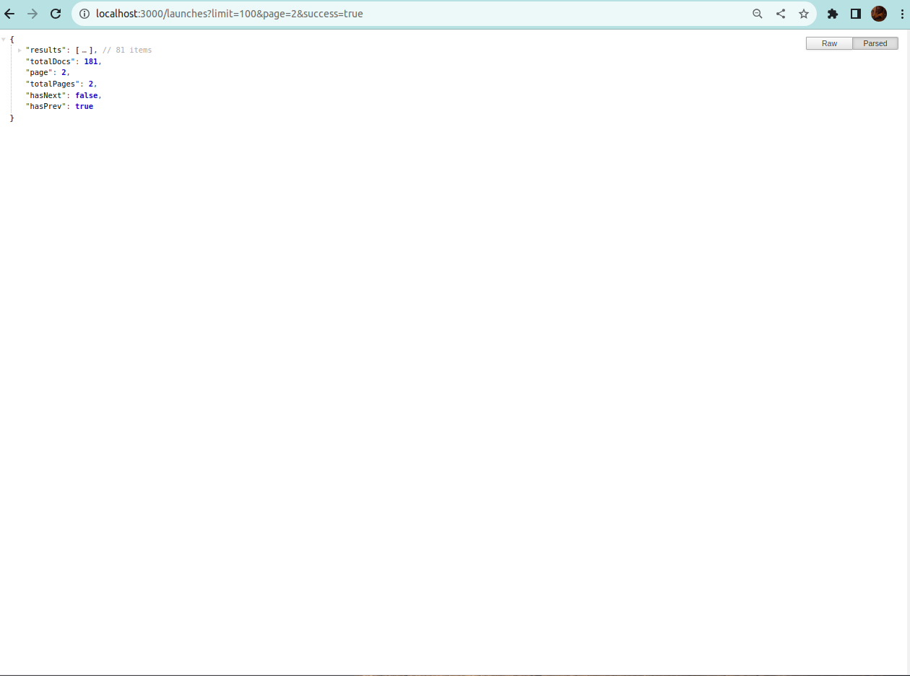

# SpaceX API - Documentação

# Guia de Execução da Aplicação

Para executar esta aplicação, siga as instruções abaixo:

## 1. Executando o Backend

Primeiro, certifique-se de executar o backend antes do frontend. Para obter informações detalhadas sobre como configurar e iniciar o backend, consulte o [documento de instruções do backend](link-do-backend).

## 2. Configuração do Banco de Dados

Esta aplicação utiliza um banco de dados de testes hospedado no MongoDB Atlas. Este serviço de banco de dados pode ocasionalmente estar sujeito a tráfego de rede e sobrecarga, o que pode afetar o desempenho da aplicação.

Se desejar alterar o banco de dados para utilizar uma instalação local do MongoDB, siga as etapas abaixo:

1. Acesse o arquivo de configuração `local-config.yaml` localizado na pasta `backend/`.

2. Adicione as informações de configuração do seu banco de dados MongoDB local a este arquivo.

## 3. Executando com Docker (Recomendado)

Para simplificar o processo de configuração e execução, recomendamos o uso de contêineres Docker. Siga os passos abaixo para construir o contêiner Docker para o backend:

1. Navegue até o diretório do backend:

cd backend/

2. Execute o seguinte comando para criar uma imagem Docker chamada `spacex`:

docker build -t spacex .

Isso permitirá que você inicie a aplicação de forma eficiente usando contêineres Docker, garantindo um ambiente de desenvolvimento consistente e facilitando a implantação em diferentes plataformas.

## 4. Iniciando o Frontend

Após ter configurado e iniciado o backend, você pode iniciar o frontend da seguinte forma:

1. Navegue até o diretório do frontend (caso ainda não esteja nele):

cd frontend/

2. Execute o comando abaixo para iniciar o frontend:

npm install
npm start

Isso iniciará o frontend da aplicação React.

## 5. Acessando a Aplicação

Após iniciar tanto o backend quanto o frontend, você pode acessar a aplicação no seu navegador em:

http://localhost:3000

## 6. Documentação

Para obter mais informações sobre as rotas da aplicação e outros detalhes, consulte a documentação em:

- [Documentação do Backend](backend/README.md)
- [Documentação do Frontend](frontend/README.md)

Certifique-se de consultar esses recursos para obter informações detalhadas sobre o funcionamento da aplicação e como interagir com ela.

## 7. Telas

1. Tela do Frontend

2. Rota inicial do backend ('/')

3. Rota da documentação Swagger ('/api-docs')

4. Rota com todos os registros de lançamentos ('/launches')

5. Rota com todos os registros de paginação de lançamentos ('/launches')

6. Rota com estatisticas de missões e lançamentos ('/launches')

7. Rota com filtros de registros de lançamentos ('/launches?limit=100&page=2&success=true')

### This is a challenge by Coodesh
